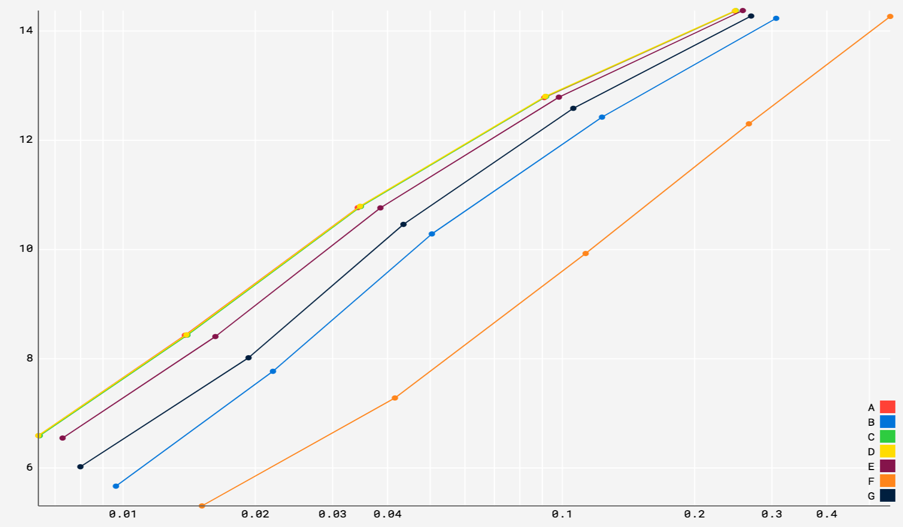

# LinuxDay Torino 20181027

## Introduzione ad AV1 e rav1e

> Luca Barbato - <lu_zero@gentoo.org>

---
# AV1

- Codec Video opensource e patent-unencumbered 
- Prodotto dall'`Alliance for Open Media`
- Mira a superare `HEVC` ed essere usato **ovunque**.
	- Gia\` presente in `Firefox` e `Chrome`
	- `Youtube` ha gia\` una selezione di video codificati
- L'implementazione software di riferimento e\` disponibile per qualsiasi piattaforma

---
# Alliance for Open Media

Fondata nel settembre del 2015, ha ampia varieta\` di membri.

---
# Performance di AV1

Il report del 2017 dell'[Universita\` statale di Mosca](http://www.compression.ru/video/codec_comparison/hevc_2017/MSU_HEVC_comparison_2017_P5_HQ_encoders.pdf), mostra come AV1 codificato dall'implementazione di riferimento (libaom), fornisca una qualita\` superiore ad ogni implementazione di HEVC testata, ma al contempo richieda la maggior quantita\` di tempo. 

> (grafici omessi per i soliti motivi, il pdf e\` disponibile in compenso...)

---
# Limiti di libaom

Libaom fornisce ottima qualita\` al costo in tempi di codifica enormente dilatati.

| | Tempo di codifica (secondi) | Lentezza rispetto al tempo reale |
|-       |      -:|      -:|
| AV1    | 226080 | 45216x |
| x265   | 289    | 58x    |
| libvpx | 226    | 45x    |
| x264   | 18     | 4x     |

---
# Difetti di libaom

- Codice di riferimento
	- Ottimizzazioni SIMD relativamente limitate
	- Implementazione C non orientata alle performance
	- Algoritmi di ricerca esaustiva usati sin troppo spesso
- Codice usato per lo sviluppo del codec
	- 295233 righe di codice C (e diverse migliaia in altri linguaggi)
	- Molte delle quali esperimenti ormai scartati
	- Finisce per confondere il lettore

---
# rav1e

[rav1e](https://github.com/xiph/rav1e) e\` un encoder scritto da zero con lo scopo di fornire una alternativa migliore a `libaom`. 

- Codice completamente nuovo
	- 25805 righe di codice Rust 
	- Reimplementazione di AV1 il piu\` indipendente possibile dalle scelte fatte in `libaom`.
	- Incompleto ma funzionante
- Scelte specifiche sull'utilizzo
	- Ridurre al minimo le opzioni di configurazione 
	- Focus su Video on-demand come primo obiettivo
		- (il corpus di Wikipedia)
	- Compressione real-time tenuta in mente ma non prioritaria

---
# Performance di rav1e

> Essendo ancora una implementazione molto semplice di settimana in settimana e di mese in mese ci sono progressi notevoli.

---
# rav1e su github
## Numero fork

---
# rav1e su github
## Numero di commit

657 Commit ad opera di 33 persone. In larga parte volontari.

---
# rav1e oggi

[rav1e](https://github.com/xiph/rav1e) si avvicina all'anno di effettivo sviluppo ed a breve sara\` possibile usarlo non solo tramite riga di comando e come crate, ma anche come libreria C tramite [crav1e](https://github.com/lu-zero/crav1e).

### Cosa manca
- **rate-control**: verra\` introdotto in questi mesi
- **ottimizzazioni SIMD**: implementate via [stdsimd](https://github.com/rust-lang-nursery/stdsimd) o assembly  direttamente.
- **multithread**: sia per-frame sia per-tile

---
# Domande?